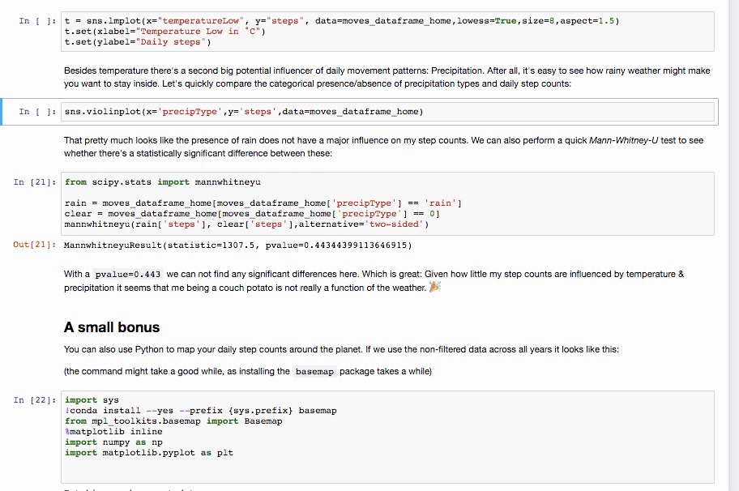

# Meet the *Personal Data Notebooks* on *Open Humans*

The [*Personal Data Notebooks* on *Open Humans*](https://www.openhumans.org/activity/personal-data-notebooks/) allow you to explore and analyze your personal data that's stored in your *Open Humans* account right in your web browser. Our Director of Research, Bastian Greshake Tzovaras, [has written about how this can help bridging our growing divide between people and algorithms](http://ruleofthirds.de/demystifying-algorithms/). *[If you've come here because of the presentation at the Sage Assembly: this is literally just that talk as a blog post]*.

Below you will find a step-by-step guide with how to get started with the *Personal Data Notebooks* and some more information about the example notebooks we already provide.

## Table of Contents
* [Getting started](#getting-started)
  + [Setting up your *Open Humans* account](#setting-up-your-open-humans-account)
  + [Start your *Personal Data Notebook*](#start-your-personal-data-notebook)
* [Example Notebooks](#example-notebooks)
  + [Analyze your physical activity](#analyze-your-physical-activity)
    - [`exploring_notebooks_fitbit.ipynb`](#exploring_notebooks_fitbitipynb)
    - [`fitbit-load-in-R.ipynb`](#fitbit-load-in-ripynb)
    - [`compare_fitbit_healthkit.ipynb`](#compare_fitbit_healthkitipynb)
    - [`twitter-and-fitbit-activity.ipynb`](#twitter-and-fitbit-activityipynb)
  + [Analyze your Tweets](#analyze-your-tweets)
    - [`twitter-sentiment.ipynb`](#twitter-sentimentipynb)
    - [`twitter-archive-text-mining-R.ipynb`](#twitter-archive-text-mining-ripynb)
    - [`twitter-under-the-weather.ipynb`](#twitter-under-the-weatheripynb)
  + [Analyze your *Moves* GPS data](#analyze-your-moves-gps-data)
    - [`moves-analysis.ipynb`](#moves-analysisipynb)
  + [Analyze your *RescueTime* productivity/computer usage data](#analyze-your-rescuetime-productivitycomputer-usage-data)
    - [`rescuetime-vs-step-counts.ipynb`](#rescuetime-vs-step-countsipynb)
  + [Analyze your *23andMe* genetic data](#analyze-your-23andme-genetic-data)
    - [`eye-color-and-23andme-data.ipynb`](#eye-color-and-23andme-dataipynb)
* [Made your own?](#made-your-own)
* [Who has access?](#who-has-access)
* [Contributors](#contributors)

## Getting started

### Setting up your *Open Humans* account
1. [Create an account with Open Humans](https://www.openhumans.org/account/signup/) or [log in into your existing account](https://www.openhumans.org/account/login/). If you have just created your account you will need to verify your email address before you can continue with the next steps.
2. Connect some data sources to your *Open Humans* account. While we have a lot of interesting data sources, our example Notebooks work with one or multiple of the following data sources (note, by default **none** of the uploaded/connected data will be made public):
  - [Fitbit](https://www.openhumans.org/activity/fitbit-connection)
  - [Apple HealthKit](https://www.openhumans.org/activity/open-humans-healthkit-integration/)
  - [Twitter archives](https://www.openhumans.org/activity/twitter-archive-analyzer/)
  - [Moves](https://www.openhumans.org/activity/moves-connection/)
  - [RescueTime](https://www.openhumans.org/activity/rescuetime-connection/)
  - [23andMe](https://www.openhumans.org/activity/23andme-upload/)

### Start your *Personal Data Notebook*
You can now head to [https://notebooks.openhumans.org](https://notebooks.openhumans.org) and click on `Sign in with OpenHumans`.

This will take you back to the main *Open Humans* page where you have to authorize the notebooks to get access to the data in your *Open Humans* account. Click on `Authorize project` to continue.

This will take you to the main page of the *Personal Data Notebooks* where your personal notebook server will boot up.

**All the steps that you have taken above are only needed for the initial setup of your *Personal Data Notebooks*. From here on you can just head to [https://notebooks.openhumans.org](https://notebooks.openhumans.org)**

You are now ready to open up one of the notebooks and run it right on your personal data!

**After opening a notebook you will see that the code in the notebooks is organized into *cells*. To run a cell you can click the `Run` button in the menu bar or press `<SHIFT> + <ENTER>` on your keyboard. Repeat this to go through each cell in the notebook.**

If this is your first time using *Jupyter Notebooks* (how exciting! 🎉) you might want to read a brief tutorial on the [Notebook Basics](http://nbviewer.jupyter.org/github/jupyter/notebook/blob/master/docs/source/examples/Notebook/Notebook%20Basics.ipynb) and [How-to execute/run code in Notebooks](http://nbviewer.jupyter.org/github/jupyter/notebook/blob/master/docs/source/examples/Notebook/Running%20Code.ipynb)

## Example Notebooks
We have a collection of example notebooks that should already be available in the root of your notebook directory. But you can also [download the raw notebooks from GitHub](https://github.com/OpenHumans/ohjh-example-notebooks).

These are notebooks should give you an idea of how the notebooks work, along with a description of the analysis they perform and example output (done on the data of [Bastian](https://www.twitter.com/gedankenstuecke)). You can run these right on your own data.

### Analyze your physical activity
We have two example notebooks that you can use to dive into your activity tracking data from Fitbit and Apple Healthkit.

#### `exploring_notebooks_fitbit.ipynb`
The [`exploring_notebooks_fitbit.ipynb` notebook](https://github.com/OpenHumans/ohjh-example-notebooks/blob/master/exploring_notebooks_fitbit.ipynb) gives you a very simple idea of what the Notebooks can do. It uses basic Python commands to analyze and plot step and heart rate data from Fitbit. As such you only need to have your Fitbit account connected to your *Open Humans* account in oder to use it.

It also gives a basic idea of how to see whether Fitbit's gamification actually works and how to spot it in the data. Does gamification work for you too?

#### `fitbit-load-in-R.ipynb`
With [`fitbit-load-in-R.ipynb`](https://github.com/OpenHumans/ohjh-example-notebooks/blob/master/fitbit-load-in-R.ipynb) we also offer a simple notebook that shows you how to load your `Fitbit` data into `R` and how subsequently analyze it.

#### `compare_fitbit_healthkit.ipynb`
[`compare_fitbit_healthkit.ipynb`](https://github.com/OpenHumans/ohjh-example-notebooks/blob/master/compare_fitbit_healthkit.ipynb) is for those dedicated to do Quantified Self with both Fitbit and an Apple Watch/iPhone. It takes data out of both your *HealthKit* import and your *Fitbit* to see how well the steps counted by both methods align. Along the description of the notebook you will find all the Python code you'll need to get started.

And if you're also wearing an Apple Watch along with a Fitbit you'll be in for a surprise.

#### `twitter-and-fitbit-activity.ipynb`
With [`twitter-and-fitbit-activity.ipynb`](https://github.com/OpenHumans/ohjh-example-notebooks/blob/master/twitter-and-fitbit-activity.ipynb) you can explore whether your physical activity and social media activity on Twitter are related and interacting with each other. The notebook uses your daily step counts from *Fitbit* along with the number of your daily tweets from the *Twitter Archive Analyzer* to visualize the relationship between the two over time.

### Analyze your Tweets

For the social media addicts we have two example Notebooks that can be used to do some analysis of your Twitter archive.

#### `twitter-sentiment.ipynb`
In [`twitter-sentiment.ipynb`](https://github.com/OpenHumans/ohjh-example-notebooks/blob/master/twitter-sentiment.ipynb) you will find a very simple sentiment analysis as performed in Python. It visualizes your polarity (are your tweets having a positive or negative sentiment overall) and your subjectivity over time.

And since this is 2018 it also contains an analysis that highlights your most-used emoji along with a sentiment classification based on this, rather than on pure text. 😍

#### `twitter-archive-text-mining-R.ipynb`
In [`twitter-archive-text-mining-R.ipynb`](https://github.com/OpenHumans/ohjh-example-notebooks/blob/master/twitter-archive-text-mining-R.ipynb) you can find an example of how you can use `R` to do text mining. It uses a very simple approach that splits tweets in more *historic* and *current* ones and from this identifies words which are over/underrepresented in these two categories, along you to find out which words/topics have become more/less important for you over time.

A similar approach is used to associate emojis with topics. ✈️🎉

#### `twitter-under-the-weather.ipynb`
In [`twitter-under-the-weather.ipynb`](https://github.com/OpenHumans/ohjh-example-notebooks/blob/master/twitter-under-the-weather.ipynb) you can explore whether the local weather has any impact on your mood as displayed in your tweets. It uses your GPS location from the `Moves` application to query for the local weather and combines this data with your text corpus from your `Twitter Archive`. Is your *subjectivity* or *polarity* influenced by the weather?

### Analyze your *Moves* GPS data

*Moves* is an app for iOS and Android that records your GPS location throughout the day and it also tries to classify your modes of transportation. You can use this data to find out how you travel the globe, to see how you much you walk around etc.

#### `moves-analysis.ipynb`
The [`moves-analysis.ipynb`](https://github.com/OpenHumans/ohjh-example-notebooks/blob/master/moves-analysis.ipynb) notebook uses your data from *Moves* to do two things:
1. It takes your historical daily GPS tracks to find out where you have been on that day. This location is then used to request the local weather on that date from the *Dark Sky* weather API service.
2. It grabs your daily walking distance & step counts.

The step counts & daily weather are then used to correlate your daily activity with the weather records, investigating how much your physical activity depends on the local outdoor temperature and rainfall/snow conditions.

### Analyze your *RescueTime* productivity/computer usage data
[RescueTime](https://www.rescuetime.com/) is a productivity tracker that monitors how you are using your computer, which websites you visit for how long etc. to see e.g. whether you spend too much time on Facebook. By connecting this data to your Open Humans account you can start to find cross-correlations with other variables in your life:

#### `rescuetime-vs-step-counts.ipynb`
With [`rescuetime-vs-step-counts.ipynb`](https://github.com/OpenHumans/ohjh-example-notebooks/blob/master/rescuetime-vs-step-counts.ipynb) you can correlate your step counts as measured by `Fitbit` and `Apple HealthKit` to see whether your productivity or overall computer use has some impact on your daily step counts.

### Analyze your *23andMe* genetic data

#### `eye-color-and-23andme-data.ipynb`
The [`eye-color-and-23andme-data.ipynb`](https://github.com/OpenHumans/ohjh-example-notebooks/blob/master/eye-color-and-23andme-data.ipynb) notebook compares your data to public data from [openSNP](https://opensnp.org) to explore our ability to predict eye color from genetic data. It compares your genetic data at a couple positions to ask: *Do you have the same eye color as people with a similar genotype?*

## Made your own?
You made your own *Personal Data Notebook* and think it would be a great example for other people? Please be in touch with Bastian at bastian@openhumans.org. Or if you're a GitHub person: [Make a pull request against our Example Notebook repository](https://github.com/OpenHumans/ohjh-example-notebooks).

## Who has access?
Only you have access to your *Personal Data Notebook*. When you first start, your folder will contain some initial notebooks which you may edit. Any changes that you make to the initial notebooks, or any new notebooks that you create will not be visible to other users, unless you [choose to share them](#made-your-own).

## Contributors
This collection of Notebooks is growing thanks to a collection of *Personal Data Notebooks* users who write their own analyses. Notebooks and bug fixes have been contributed by:
- [Bastian Greshake Tzovaras](https://github.com/gedankenstuecke)
- [Mad Price Ball](https://github.com/madprime)
- [Kaylea Champion](https://github.com/kayleachampion)
- [Ernesto Ramirez](https://github.com/erramirez)
- [Jacob Rosenthal](https://github.com/jacobrosenthal)
